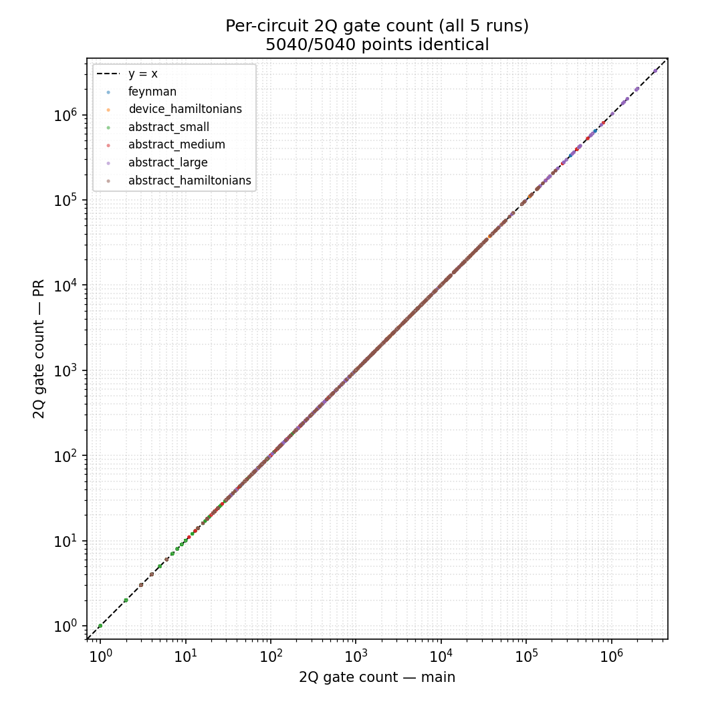
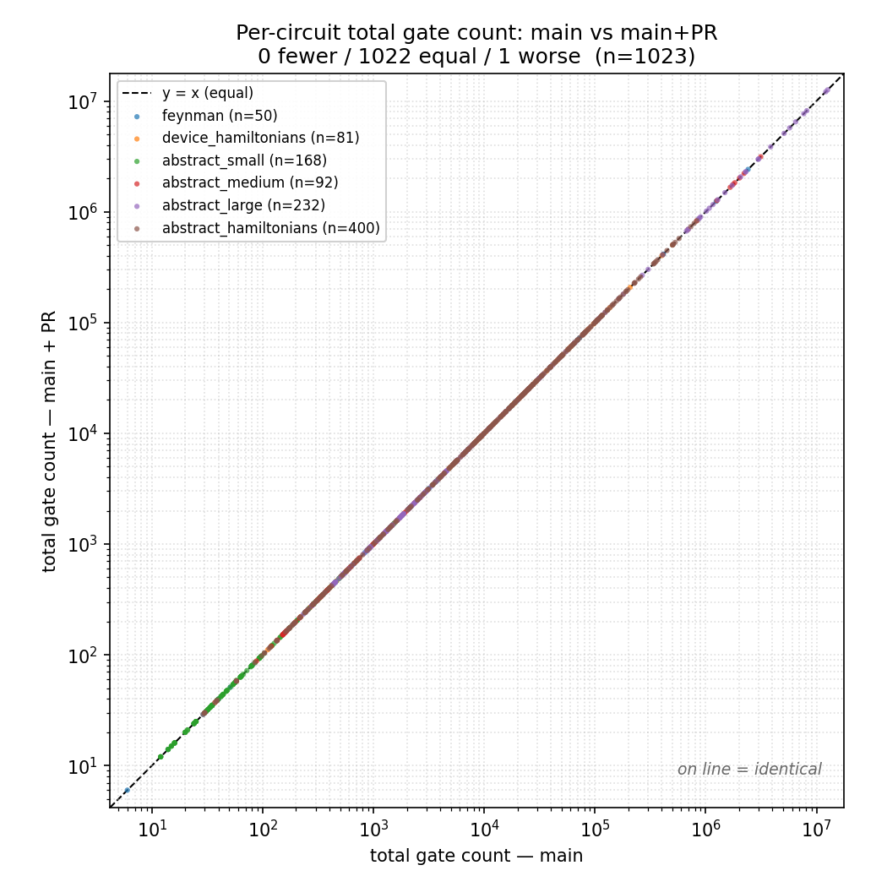
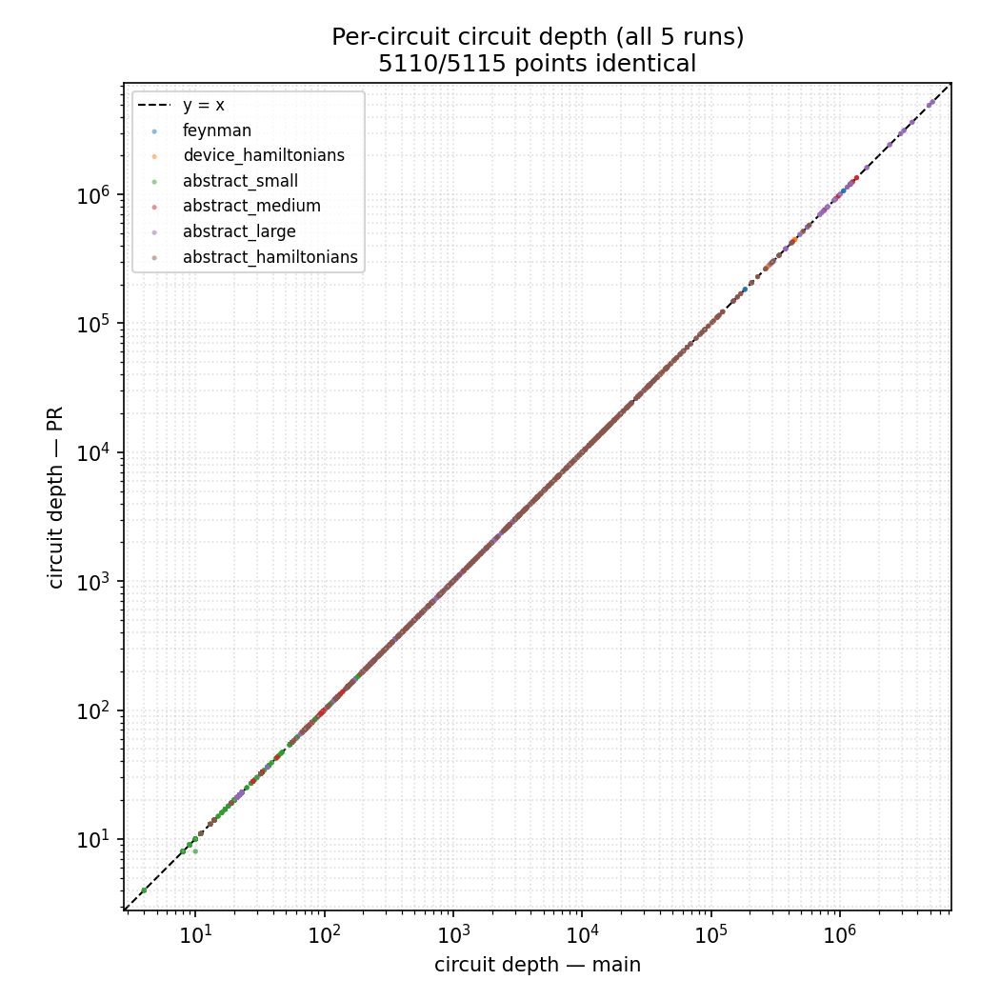
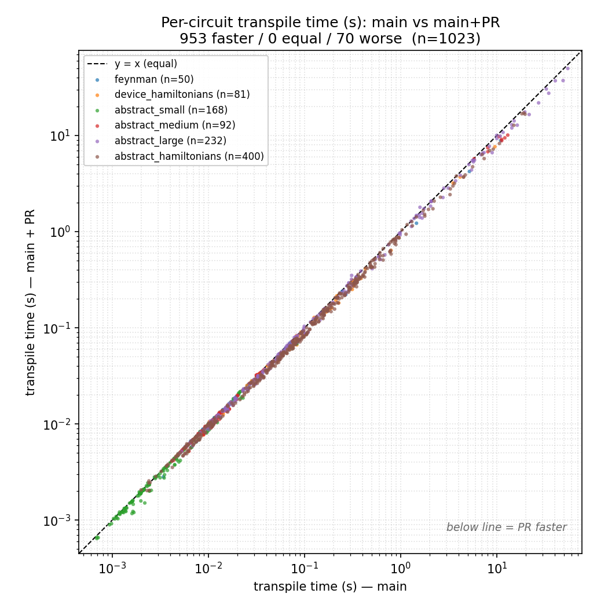

# Replace the Level-2 optimization loop's fixed-point check with direct progress signals

## The problem

At `optimization_level=2`, the transpiler runs a small group of peephole passes in a
loop — 1Q-rotation decomposition, commutative cancellation, identity removal — and
repeats it until the circuit stops improving. Today "stop" is decided by a `FixedPoint`
on circuit **depth and size**: the loop keeps going until both are unchanged across
**two consecutive** iterations.

The two-in-a-row rule has a built-in cost: the loop always runs **one extra iteration
that does no useful work**. After the last iteration that actually improves the circuit,
the loop must run the whole pass group once more, observe that nothing changed, and only
*then* declare convergence. That confirmation pass scales with circuit size and runs on
every circuit.

## The idea

We don't have to *infer* convergence from "the metrics stopped moving." Each pass already
knows whether it did something that a later pass could build on. If, in a given iteration,
**no pass created a new optimization opportunity**, the circuit is already at a fixed
point and the loop can stop immediately — the confirmation iteration is redundant.

So the exit condition is no longer `FixedPoint("size", "depth")`. Instead the passes raise
three boolean signals, and the loop continues only if at least one of them fired.

## Why these three signals

Each signal is a concrete event that can expose *further* optimization on the next
iteration. The important property is the **converse**: if none fired, nothing happened
that another iteration could act on, so exiting now yields the *same circuit* as the
fixed-point loop — just one iteration sooner.

1. **A 2-qubit gate was removed** — `CommutativeCancellation` cancelled a CX/CZ pair, or
   `RemoveIdentityEquivalent` dropped a near-identity 2Q gate. Removing a 2Q gate changes
   which gates are now adjacent, which can expose new commutations and cancellations.

2. **1-qubit rotations were consolidated** — `Optimize1qGatesDecomposition` merged
   same-axis rotations into a shorter run. Consolidation reshapes 1Q runs and can open
   further merges. This signal matters for correctness, not just speed: with a 2Q-only
   exit, a few circuits (e.g. QFT, QAOA) stopped one iteration early and kept a handful of
   un-merged 1Q rotations — a small gate-count increase versus the fixed-point loop. This
   signal closes that gap.

3. **Out-of-basis gates were produced** — while consolidating, `CommutativeCancellation`
   can emit a gate outside the target basis (e.g. an `RX`); `GatesInBasis` then flags the
   circuit and `BasisTranslator` runs inside the loop. A fresh translation produces
   *unoptimized* sequences that the peephole passes can still clean up, so the loop must
   continue. (Added after review — without it the loop could exit leaving a
   freshly-translated, unoptimized sequence in place.)

## Scope

`optimization_level=2` only — levels 1 and 3 are unchanged. The three passes now return
whether they raised each signal, and the preset pass manager's loop condition consumes
those signals in place of the `FixedPoint`.

## Results

Benchmarked on the full [Benchpress](https://github.com/Qiskit/benchpress) transpile
suite — **1,023 circuits** (feynman, device-Hamiltonian, and abstract QASMBench /
Hamiltonian groups) — comparing current `main` against `main` + this PR. Both built
release + mimalloc; baseline and PR run concurrently on separate NUMA sockets;
`QISKIT_TRANSPILER_SEED=1`. Each point is one circuit; the dashed line is `y = x`.

**The output does not change.** Across all 1,023 circuits the 2Q-gate count, total-gate
count, and depth are bit-identical between `main` and the PR — every point sits on the
diagonal.

| 2Q gate count | total gate count | total depth |
|:---:|:---:|:---:|
|  |  |  |

**The compile is faster.** Removing the confirmation iteration reduces end-to-end
`pm.run` wall-clock by **≈13%** in aggregate. Nearly every substantial circuit falls
below the diagonal (faster); the points on or above it are sub-10 ms circuits where the
difference is timing noise.

The single off-diagonal point in the total-gate plot is a **pre-existing, unseeded
1Q-rotation tie-break** in Qiskit (verified to vary on `main` by itself across repeated
runs) — not a change introduced by this PR.

## Reproducing

Raw per-group benchmark JSON, the run/analysis scripts, the Benchpress recording patch,
the rebased commits, and these plots are all in this directory. Start with `REPRODUCE.md`.

## AI / LLM disclosure

- [x] I used the following tool to help write this PR description, the benchmark harness,
  and the code: **Claude Code (Claude Opus)** — the rebase onto current `main`, the
  conflict resolution in the parallelized 1Q-decomposition pass, the benchmark
  orchestration/analysis, and this write-up were produced with Claude Code; a human
  reviewed every line.
